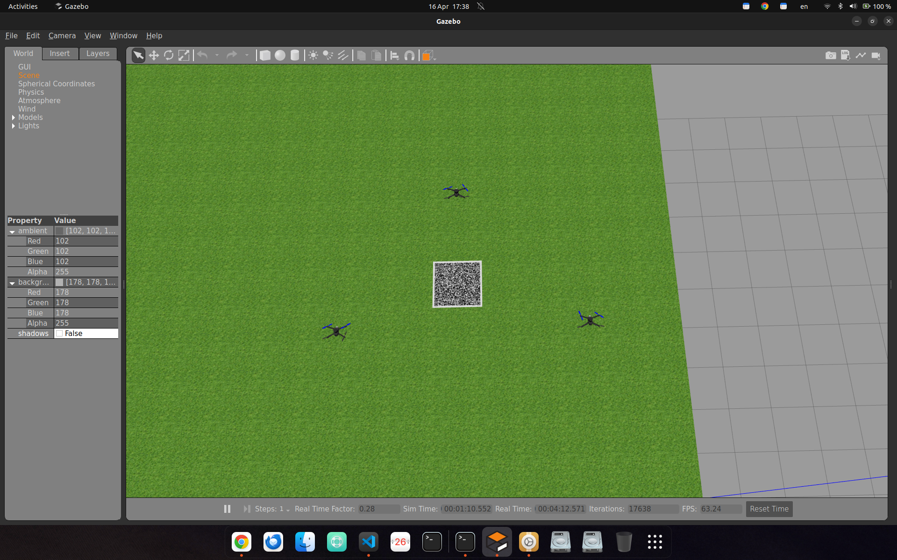

# Swarm Formation Control  

In this project I conducted a simulation to control drone swarms to perform coordinated formations, for example 3 UAVs rotate with several formation configurations, namely Line where 3 UAVs are lined up on the same line, then V formation UAV 2 is behind and arrow formation where UAV 2 is in front, this project simulates how 3 UAVs can perform movements, one of which is rotation, in rotating UAV 1 will be the axis of rotation or pivot, to do this I use the implementation of the rotation matrix in 2-dimensional coordinates, I assume the drones are on the same y-axis coordinates and the distance between each drone is 3 meters

This How the calculation to rotates a 3-drone formation **90° to the left** using a rotation matrix.

- **Pivot drone:** `uav1` (drone 1)
- **Spacing:** `3` local pose units between drones
- **Formation before rotation:** inline on X-axis from pivot

**Figure 1** UAV Swarm Simulation in Gazebo Classic

## Rotation Matrix Used

For left rotation by angle $\theta$ in 2D:

$$
R(\theta)=
\begin{bmatrix}
\cos\theta & -\sin\theta \\
\sin\theta & \cos\theta
\end{bmatrix}
$$

For this project, $\theta=90^\circ$.

Target point is computed as:

$$
p' = p_{pivot} + R(90^\circ)\,p_{offset}
$$

Where:
- $p_{pivot}$ = position of `uav1`
- $p_{offset}$ = offset by drone id: drone1 $(0,0)$, drone2 $(3,0)$, drone3 $(6,0)$

## Simple Example

If `uav1` is at $(2,5)$:

- Drone1 offset $(0,0)$ → target $(2,5)$
- Drone2 offset $(3,0)$ → after +90° becomes $(0,3)$ → target $(2,8)$
- Drone3 offset $(6,0)$ → after +90° becomes $(0,6)$ → target $(2,11)$

So final rotated formation is vertical, still spaced by `3` units.

---
***Made With ❤️ By Mohammad Khirz El Jausyan***
